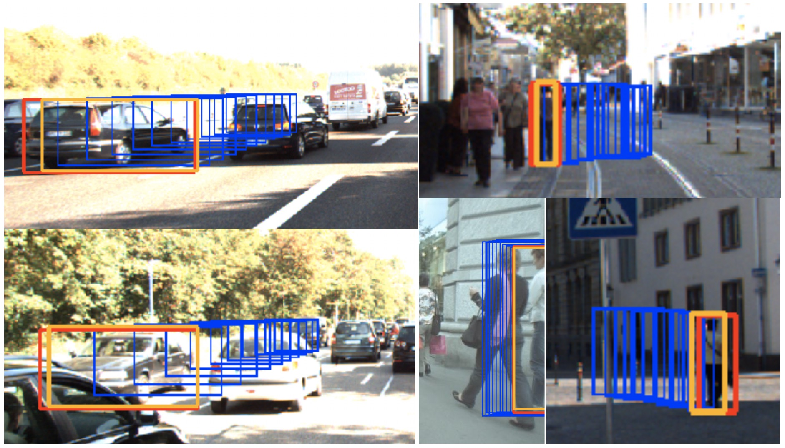

# LSTM Tracker

## Introduction
This module contains code for running a LSTM network to track objects using only the 
spatial information. KITII and MOT datasets are used for training and validation purposes. 

If using this work, you may cite the following:
```
@misc{ranasinghe2019extending,
    title={Extending Multi-Object Tracking systems to better exploit appearance and 3D information},
    author={Kanchana Ranasinghe and Sahan Liyanaarachchi and Harsha Ranasinghe and Mayuka Jayawardhana},
    year={2019},
    eprint={1912.11651},
    archivePrefix={arXiv},
    primaryClass={cs.CV}
}
```

## Dependencies
The following libraries are required. 
* python==3.6
* tensorflow==1.12.0
* pillow
* matplotlib
* numpy

The project root is /lstm_tracker.

The docker container kahnchana/tf:tf1gpu can be used (contains all requirements). This
requires nvidia-docker and a GPU enabled machine. 

## Visualize Data
Data can either be generated from the raw datasets or the processed data (JSON files 
containing tracks) which can be downloaded from 
[here](https://drive.google.com/open?id=1fhdGeDoRCp9KYOuoghJFgjJvcS2tPTYv). These two 
JSON files should be placed inside the /data folder (create the folder if not present
already). 

Afterwards use ```trainer.data.vis_gen()``` to visualize the data. Set the required 
dataset from code. Also fix the paths 

## Train & Evaluate
Make sure the models folder exists. 
Afterards, refer to ```trainer/train.sh``` to run a training. The file ```trainer/train.py``` contains 
the start-point for training. 

For running training on a GPU enabled machine, simply run the following:
``` 
cd PATH_TO_REPO_ROOT/fyp_2019/LSTM_Kanchana/trainer

./run_docker.sh "train.sh PATH_TO_REPO_ROOT"
```
This will use a pre-built docker image. In case of a permission error, 
run ```chmod +x run_docker.sh train.sh``` to give execute permissions. 


To run without a docker image (on a machine with all dependencies) run:
```
./train.sh PATH_TO_REPO_ROOT
```

NOTE: change required parameters from the train.sh file for different experiments. Do 
remember to change the job_dir (model/logs saving directory) for each new experiment. 

## Evaluate & Visualize
Refer to ```trainer/infer.py``` to run inference on a dataset with visualizations. This 
file also contains code to obtain IOU-matched precision and MSE accuracy. 
 

## Sample Output
A few sample tracked frames are shown below.

